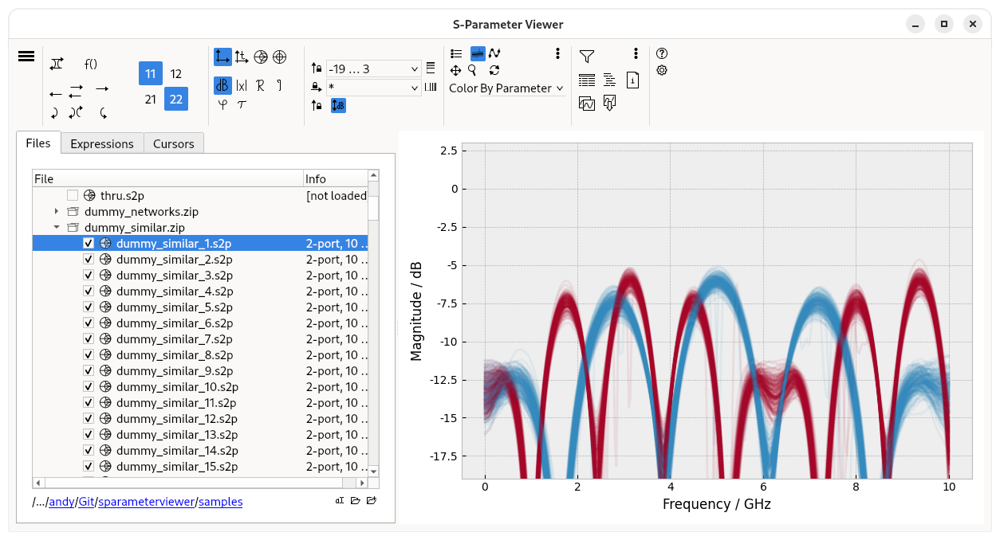

S-Parameter Viewer
==================

A cross-platform S-parameter Viewer written in Python.

 

Main Features
-------------

- Visualize touchstone and Citi files, including those inside of .zip-files.
- Various flexible ways of displaying S-parameters, e.g. IL (all/reciprocal) only / RL only, linear/dB/Smith-chart/re-im, impulse/step response, Phase (normal/unwrapped), Group Delay.
- Plotting of Python-based expressions, including functions for stability factors and stability circles, for adding passive elements, checking for passivity/reciprocity/losslessness.
    - to learn more about this feature [see here](./doc/expressions.md).
- Viewing data in various table formats (e.g. dB, linear, real/imaginary, phase).
- Export data to .csv or .xlsx, copy data as Python code, save plots as images.

Documentation
-------------

[See here](./doc/main.md).

Roadmap
-------

### Missing Features

- GUI: find a way to present the large matrix in a bigger form, e.g. as a dialog.
- GUI: pre-defined fixed size for saved/copied plots.
- GUI: find a nicer representation than plain markdown files.
- General: "TODO"-comments in code.
- GUI: expression file quick-save/quick-load and file history.
- File handling: show correct parameter names of mixed-mode parameters in `Networks.s()`, and in the GUI.
- Expressions: better interaction with Numpy. How can I use numpy functions with traces? What if I have two different parameters and a binary operation?
- Expressions: function to set plot type (i.e. when I run that equation, it automatically sets up the plot type).
- Expressions: log output for equations (so that you can also print some data or status).
- File type registration script for Windows (using `assoc` and `ftype`).

### Known Issues

- Under Fedora Linux, Gnome freezes when you open a non-Touchstone file, then open the same file again with a proper viewer; reason unknown.
