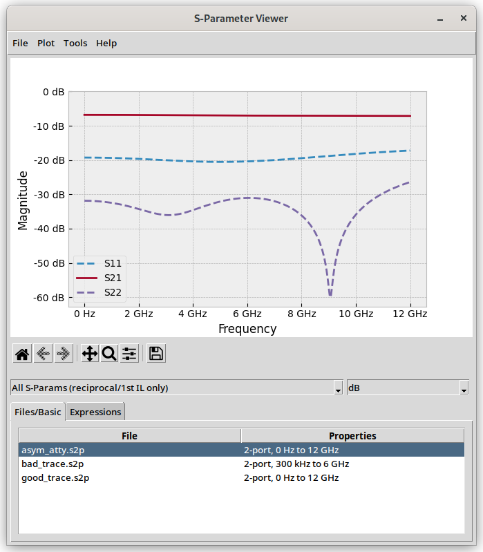
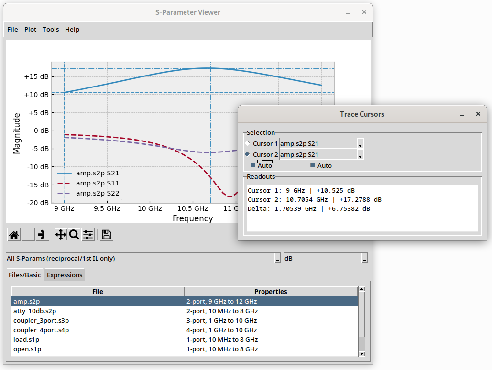
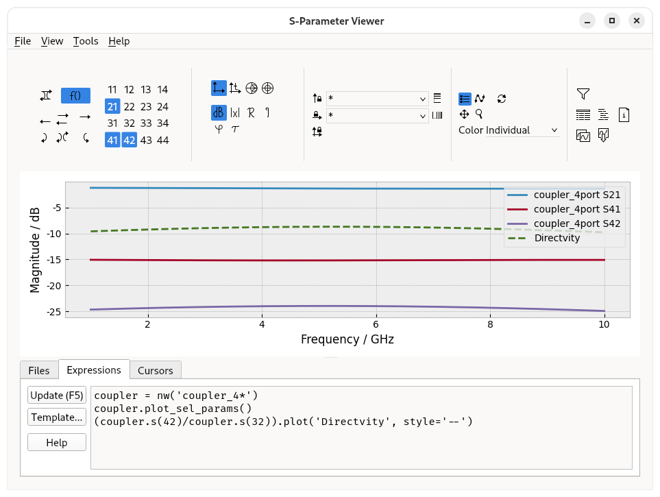

S-Parameter Viewer
==================

A cross-platform S-parameter Viewer written in Python.

  

Main Features
-------------

- Various flexible ways of displaying S-parameters, e.g. IL (all/reciprocal) only / RL only, linear/dB/Smith-chart/re-im, impulse/step response, Phase (normal/unwrapped), Group Delay
- Plotting of Python-based expressions, including functions for stability factors and stability circles, for adding passive elements, and for Bode-Fano optimum RL estimation
    - to learn more about this feature, open the "Expressions" tab, and click "Help"
- Export to CSV or XLSX

Prerequisites
-------------

- Python 3.7
- Packets: `numpy, scipy, skrf, matplotlib, tkinter, pygubu, openpyxl`

Usage
-----

- you can just start the app and load a directory
- or you can open one or more file with the app

### Linux

Under Linux, you can use `res/application-x-scatteringparameter.xml` to register a mime-type for S-parameter files. For instructions, see e.g. <https://help.gnome.org/admin/system-admin-guide/stable/mime-types-custom-user.html>.

### Windows

Under Windows, you can use `res/sparamviewer.bat` to launch the app from "*Open With...*". You have to adapt the paths in the file.
	

Development
-----------

To modify the UI, you need `pygubu-designer`.

There are sample .json-files in the `res` folder for VS Code.

Known Issues and Missing Features
---------------------------------

- Under Fedora Linux, Gnome freezes when you open a non-Touchstone file, then open the same file again with a proper viewer reason unknown
- Smarter name shortening
- Equation-based plot type
