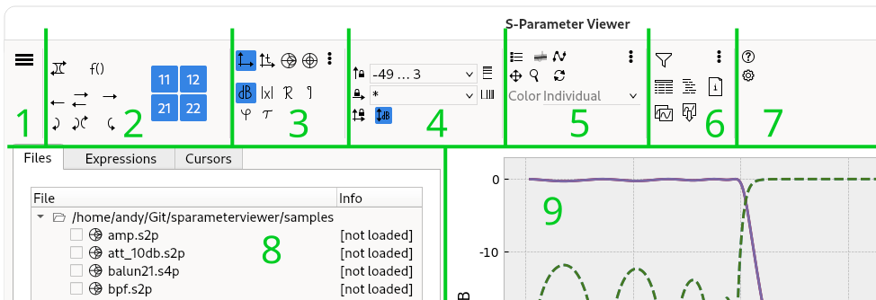

S-Parameter Viewer Documentation
================================

Main Window
-----------

1. Main menu.
2. **Parameter Selector**: select which S-parameters to plot.
    - The buttons allow to qickly select the most important parameters. Hold *Ctrl* to toggle.
    - The matrix allows to select individual parameters. Hold *Ctrl* to toggle, hold *Shift* to select diagonal/triangular.
    - The "f(x)"-button to turon on expression-bases plotting
3. **Plot Selector**: Cartesian (vs. frequency),  [time-domain](./timedomain.md), Smith, or polar.
    - Options for cartesian: dB/magnitude/real/imag, phase/group delay.
        - For phase, you can additionally do unwrapping, or unwrapping + de-trending. Phase unit in menu.
    - Options for time-domain: impulse or step response. Windowing options and impedance conversion in menu.
    - Options for Smith: Z- or Y-plane.
4. **Axis Range**:
    - Enter a range, e.g. "0..20G" for 0 to 20 GHz, or "*" for auto-scale.
    - Use the lock buttons to toggle between a fixed range, or auto-scale.
    - You can enable smart dB scaling (only if Y-axis is in dB), which attempts to focus on the upper region of the S-parameters.
5. **Plot Options**: legend, trace options, plot tools.
    - Additional options in the menu.
6. **Tools**:
    - Filter to quickly select files that match a pattern.
    - Copy/save graph.
    - The [tabular view](./tools.md) allows to view the parameters as a table, and to export it in valious formats.
    - Additional tools in the menu.
7. **Help** and **Settings**.
8. **Filesystem Browser**, **Expressions** and **Cursors**.
9. **Graph**.

### Filesystem Browser

How to navigate:
- Use the breadcrumb bar (hidden when multiple/no directories are selected), or the buttons next to it.
- Use "Open Directory" from the main menu.
- Right-click a directory (hidden when simplified filesystem browser is enabled in settings).

How to select files for plotting:
- All checked files are plotted.
- How to change an item being checked:
    - Just click the checkbox of a file to toggle it; *or*
    - If the setting "*Selected Files Are Automatically Checked*" is enabled, click or select files (hold the *Ctrl* key for a range), and they will be checked automatically.
    - Otherwise, if the setting "*Selected Files Are Automatically Checked*" is disabled, double-click any file to toggle its checkbox.
    - Select any number of files then:
        - Press the spacebar to toggle the checks of all selected files.
            - Hold *CTRL* to toggle the checks of *each file individually* (instead of checking *all* selected files, or un-checking *all* selected files).
            - Hold *SHIFT* to un-check all files that are not selected.
        - Press the *+* key to check the selected files.
        - Press the *Enter* (*Return*) key to check the selected files, and un-check all others (similar to *SHIFT+Spacebar*).
        - Press the *-* key to un-check the selected files.

### Expressions

By default, you use the Parameter Selector to choose which parameter are plotted.

However, using Python-based expressions, you have even more control over what is plotted. [See here](expressions.md).

You can use the "Template" button to automatically generate useful expressions. Note that you can right-click a file in the Filesystem Browser, and click "Save for Template", which selects the reference network that is needed by some templates.

### Cursors

Allows you to read values from the plot using cursors.

Just click in the plot, and the reading is shown in the dialog. You may select one of two cursors, or let the tool select the closest cursor automatically (*Auto*). You may specify a specific trace, or let the tool snap the cursor to the closest trace (*Auto*).

Note that you can only apply cursors to traces on the primary (left) Y-axis. If you want to use cursors on e.g. phase, disable the primary unit.

Additional Tools
----------------

[See here](tools.md).

Settings
--------

You can open the settings from the toolbar, or by pressing F4.

Use the mouse-over tooltips to learn more about each setting in the settings dialog.

Most settings become active immediately.

Supported File Formats
----------------------

- Touchtone files (.s1p, .s2p, etc.): standard S-parameter files.
- CITI files (.cti or .citi): a data format for n-dimensional data. Since there is no hard specification on the variable names, the following names are assumed (case-insensitive):
    - Frequency: `f`, `Freq` or `Frequency`.
    - S-parameters: `Sij`, `Si,j`, `S(ij)`, `S(i,j)`, `S[ij]` or `S[i,j]` (where `ij` or `i,j` are the port numbers `i` and `j`), e.g. "S21" or "S[2,1]".
- Zip files (.zip): touchstone and CITI files inside of .zip-files can be extracted as well (can be configured in the settings dialog).
